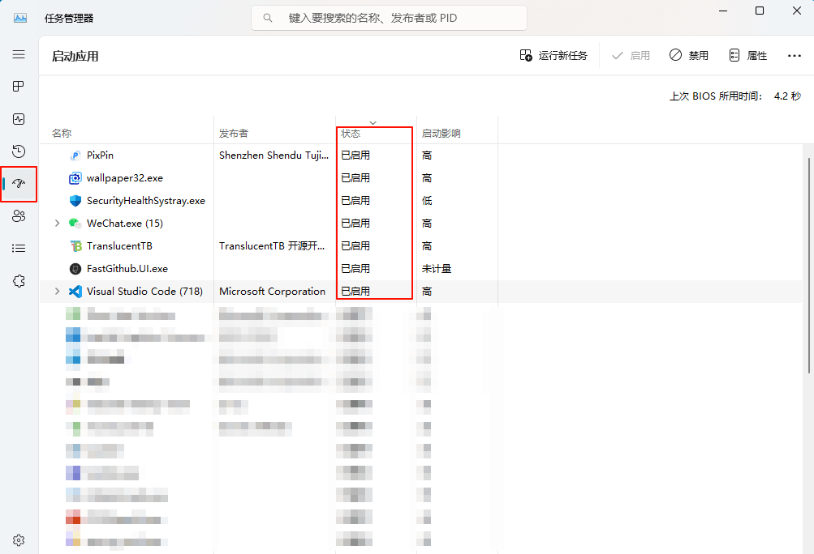

# window 自定义开机自启动程序

## 引言

在日常工作中，我们经常需要在开机时自动启动一些常用程序（如 Vscode、微信等），但并非所有程序都提供了开机启动的选项。为了解决这个问题，我们可以使用 Windows 系统的自启动功能来实现。

## 设置自启动

为程序设置自启动其实非常简单。首先，需要打开以下文件夹路径：

```
C:\Users\用户名\AppData\Roaming\Microsoft\Windows\Start Menu\Programs\Startup
```

将你想要开机自动启动的程序的快捷方式复制或移动到该文件夹中即可。另外，你也可以通过`win + r`快捷键输入`shell:startup`快速打开这个自启动文件夹。


完成上述操作后，你的程序快捷方式会出现在该文件夹中，如图所示：


## 关闭自启动

如果你之前通过上述方法添加了自启动程序，想要关闭自启动，只需从该文件夹中删除对应的快捷方式即可。

此外，Windows 系统可以通过任务管理器来管理所有自启动程序（包括通过快捷方式添加的自启动程序）。你可以通过任务管理器来查看和关闭这些自启动项。



需要注意的是，通过添加快捷方式方式设置的自启动程序，一旦你在任务管理器中关闭了它，那么任务管理器中将不会再显示改该程序的自启动情况，只能再将快捷方式添加到上方文件夹中来开启自启动功能。
