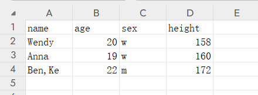

# 使用 xlsx.js 轻松处理 Excel 数据

[xlsx.js](https://www.npmjs.com/package/xlsx) 是一个开源的 JavaScript 库，用于读取、写入和处理 Excel 文件。它支持多种文件格式，包括 .xlsx、.xls、.csv 等，并且可以在浏览器和 node.js 环境中使用。XLSX.js 的核心功能包括：读取 Excel 文件：支持从文件中读取数据并将其转换为 JSON 格式，方便后续处理。写入 Excel 文件：可以将数据导出为 Excel 文件，支持自定义样式和格式。

## 引入

1. 通过 CDN 引入

```html title=hidden
<script src="https://cdn.sheetjs.com/xlsx-latest/package/dist/xlsx.full.min.js"></script>
```

1. npm 引入

```bash title=hidden
npm install xlsx
```

## 读取

在以下表格内容时



1. 在 node 环境中可以直接读取路径文件：

```js
const workbook = XLSX.readFile(filepath, opts);
```

1. 在 web 环境中则可以读取存储中的文件数据：

```js
inputDom.addEventListener(
  'change',
  function handleFileAsync(e) {
    const file = e.target.files[0];
    const data = await file.arrayBuffer();
    const workbook = XLSX.read(data);
  }
);
```

> 读取到的数据保存在 `Sheets` 字段中，表单名保存在 `SheetNames` 中，这时还不方便直接处理;

### sheet_to_json 读取为对象数组

可以通过 `sheet_to_json` 将数据转化为对象数组，以第一行为键名，其他行为键值：

```js
const data = XLSX.utils.sheet_to_json(workbook.Sheets[workbook.SheetNames[0]]);
```

```json
[
  { "name": "Wendy", "age": 20, "sex": "w", "height": 158 },
  { "name": "Anna", "age": 19, "sex": "w", "height": 160 },
  { "name": "Ben,Ke", "age": 22, "sex": "m", "height": 172 }
]
```

### sheet_to_csv 读取为 csv 多行字符串

```js
const data = XLSX.utils.sheet_to_csv(workbook.Sheets[workbook.SheetNames[0]]);
```

```text
name,age,sex,height
Wendy,20,w,158
Anna,19,w,160
"Ben,Ke",22,m,172
```

### sheet_to_html 快捷生成 html 代码

```js
const data = XLSX.utils.sheet_to_html(workbook.Sheets[workbook.SheetNames[0]]);
```

```html
<html>
  <head>
    <meta charset="utf-8" />
    <title>SheetJS Table Export</title>
  </head>
  <body>
    <table>
      <tr>
        <td data-t="s" data-v="name" id="sjs-A1">name</td>
        <td data-t="s" data-v="age" id="sjs-B1">age</td>
        <td data-t="s" data-v="sex" id="sjs-C1">sex</td>
        <td data-t="s" data-v="height" id="sjs-D1">height</td>
      </tr>
      <tr>
        <td data-t="s" data-v="Wendy" id="sjs-A2">Wendy</td>
        <td data-t="n" data-v="20" id="sjs-B2">20</td>
        <td data-t="s" data-v="w" id="sjs-C2">w</td>
        <td data-t="n" data-v="158" id="sjs-D2">158</td>
      </tr>
      <tr>
        <td data-t="s" data-v="Anna" id="sjs-A3">Anna</td>
        <td data-t="n" data-v="19" id="sjs-B3">19</td>
        <td data-t="s" data-v="w" id="sjs-C3">w</td>
        <td data-t="n" data-v="160" id="sjs-D3">160</td>
      </tr>
      <tr>
        <td data-t="s" data-v="Ben,Ke" id="sjs-A4">Ben,Ke</td>
        <td data-t="n" data-v="22" id="sjs-B4">22</td>
        <td data-t="s" data-v="m" id="sjs-C4">m</td>
        <td data-t="n" data-v="172" id="sjs-D4">172</td>
      </tr>
    </table>
  </body>
</html>
```

### sheet_to_text 生成制表符分隔的多行字符串

```js
const data = XLSX.utils.sheet_to_text(workbook.Sheets[workbook.SheetNames[0]]);
```

```text
name	age	sex	height
Wendy	20	w	158
Anna	19	w	160
Ben,Ke	22	m	172
```

### sheet_to_formulae 获取每个单元格对应内容

```js
const data = XLSX.utils.sheet_to_formulae(workbook.Sheets[workbook.SheetNames[0]]);
```

```json
[
  "A1='name",
  "B1='age",
  "C1='sex",
  "D1='height",
  "A2='Wendy",
  "B2=20",
  "C2='w",
  "D2=158",
  "A3='Anna",
  "B3=19",
  "C3='w",
  "D3=160",
  "A4='Ben,Ke",
  "B4=22",
  "C4='m",
  "D4=172"
]
```

### 读取为二维数组

没有直接的方法可以将数组处理成二维数组，但是可以通过设置 opts 方式完成。

```js
const data = XLSX.utils.sheet_to_json(workbook.Sheets[workbook.SheetNames[0]], { header: 1 });
```

```json
[
  ["name", "age", "sex", "height"],
  ["Wendy", 20, "w", 158],
  ["Anna", 19, "w", 160],
  ["Ben,Ke", 22, "m", 172]
]
```

## 创建，写入，下载

```js
const workbook = XLSX.utils.book_new(); // 通过 `book_new` 方法创建一个虚拟 workbook。
const worksheet = XLSX.utils.json_to_sheet(jsonData); // 通过 `json_to_sheet` 等方法创建一个虚拟 worksheet。
XLSX.utils.book_append_sheet(workbook, worksheet, `Sheet1`); // 将虚拟 worksheet 添加入虚拟 workbook中
XLSX.writeFile(workbook, `filename.xlsx`); // 导出创建的虚拟 workbook
```

类似创建虚拟 worksheet 的方法还有：

1.  `aoa_to_sheet` 通过二维数组转为虚拟 worksheet。
1.  `table_to_sheet` 通过 table dom 标签转为虚拟 worksheet。

对于已经存在的表单可以进行追加操作：

1. `sheet_add_aoa` 将数组数据添加到现有的 worksheet 中。
1. `sheet_add_json` 将对象数据添加到现有的 worksheet 中。

```js
XLSX.utils.sheet_add_aoa(worksheet, [['emoji', 20, 'w', 165]]);
```

## 删除

该库目前还没有直接删除表单或者列行的方法可以调用，这意味着在删除现有表单或数据时常常需要重建。

如果只改变数据，使用工具函数进行自动生成也许会方便一些：

```js
const xlsxData = [
  {
    name: 'sheet1',
    data: [
      { name: 'Wendy', age: 20, sex: 'w', height: 158 },
      { name: 'Anna', age: 19, sex: 'w', height: 160 },
    ],
  },
  {
    name: 'sheet2',
    data: [{ name: 'Ben,Ke', age: 22, sex: 'm', height: 172 }],
  },
];
```

```js
function data2workbook(data) {
  const workbook = XLSX.utils.book_new();
  data.forEach((sheet) => {
    const worksheet = XLSX.utils.json_to_sheet(sheet.data);
    XLSX.utils.book_append_sheet(workbook, worksheet, sheet.name);
  });
  return workbook;
  // XLSX.writeFile(workbook, `filename.xlsx`);
}
```

## 参考

[xlsx - npm](https://www.npmjs.com/package/xlsx)
