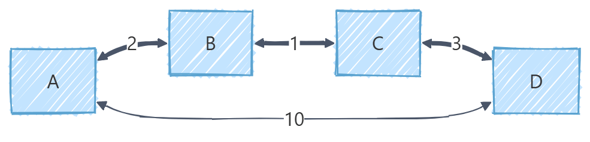

# Floyd 算法（弗洛伊德算法）

Floyd 算法是一种基于动态规划思想的多源最短路径算法，由 Robert Floyd 于1962年提出。它能够高效求解带权有向图或无向图中所有顶点对之间的最短路径，同时还能检测图中是否存在负权环（负权环会导致某些最短路径无解，因为可以绕环无限缩短路径长度）。

## 算法原理

Floyd 算法采用动态规划的思想，通过不断尝试将每个顶点作为中间节点，来更新任意两点之间的最短路径。

设 `dist[i][j]` 表示从顶点 i 到顶点 j 的最短路径长度。对于每个中间顶点 k，检查是否通过 k 可以使从 i 到 j 的路径更短：

```
dist[i][j] = min(dist[i][j], dist[i][k] + dist[k][j])
```

有如下路径图时：


有如下路径图时：

从 `A -> C` 的直接路径权重为10，但通过 `A -> B -> C` 只需要 `2 + 1 = 3`。



从 `A -> C` 的直接路径权重为10，但通过 `A -> B -> C -> D` 只需要 `2 + 1 + 3 = 6`。

## 算法步骤

1. 初始化距离矩阵，直接相连的边权重为边权，不直接相连的设为无穷大，对角线设为0（自身到自身）。
2. 三重循环遍历所有顶点：
   - 外层循环：选择中间顶点 k
   - 中层循环：选择起点 i
   - 内层循环：选择终点 j
3. 对于每个 (i, j) 对，检查是否通过 k 可以缩短路径
4. 最终得到所有顶点对之间的最短路径

> > 算法执行后，如果某个顶点到自身的距离为负数，则说明存在负权环

以下是 [2976. 转换字符串的最小成本 I - 力扣（LeetCode）](https://leetcode.cn/problems/minimum-cost-to-convert-string-i/description/) 题的解决字符变换最小成本问题的 Floyd 算法应用：

```javascript
/**
 * @param {string} source
 * @param {string} target
 * @param {character[]} original
 * @param {character[]} changed
 * @param {number[]} cost
 * @return {number}
 */
var minimumCost = function (source, target, original, changed, cost) {
  const costMap = Array.from({ length: 26 }, (_) => new Array(26).fill(Infinity));
  for (let i = 0; i < original.length; i++) {
    const x = original[i].charCodeAt(0) - 97;
    const y = changed[i].charCodeAt(0) - 97;
    costMap[x][y] = Math.min(costMap[x][y], cost[i]);
  }

  for (let k = 0; k < 26; k++) {
    costMap[k][k] = 0;
    for (let i = 0; i < 26; i++) {
      for (let j = 0; j < 26; j++) {
        costMap[i][j] = Math.min(costMap[i][j], costMap[i][k] + costMap[k][j]);
      }
    }
  }

  let minCost = 0;
  for (let i = 0; i < source.length; i++) {
    const ct = costMap[source.charCodeAt(i) - 97][target.charCodeAt(i) - 97];
    if (ct === Infinity) return -1;
    minCost += ct;
  }
  return minCost;
};
```

以下是 [2642. 设计可以求最短路径的图类 - 力扣（LeetCode）](https://leetcode.cn/problems/design-graph-with-shortest-path-calculator/description/) 题的解决最近路径问题：

```js
/**
 * @param {number} n
 * @param {number[][]} edges
 */
var Graph = function (n, edges) {
  Graph.n = n;
  Graph.costMap = Array.from({ length: Graph.n }, (_) => new Array(Graph.n).fill(Infinity));
  for (const eg of edges) {
    Graph.costMap[eg[0]][eg[1]] = eg[2];
  }
  for (let k = 0; k < Graph.n; k++) {
    Graph.costMap[k][k] = 0;
    for (let i = 0; i < Graph.n; i++) {
      for (let j = 0; j < Graph.n; j++) {
        Graph.costMap[i][j] = Math.min(Graph.costMap[i][j], Graph.costMap[i][k] + Graph.costMap[k][j]);
      }
    }
  }
};

/**
 * @param {number[]} edge
 * @return {void}
 */
Graph.prototype.addEdge = function (edge) {
  const [from, to, weight] = edge;
  if (weight > Graph.costMap[from][to]) return;
  Graph.costMap[from][to] = weight;
  for (let i = 0; i < Graph.n; i++) {
    for (let j = 0; j < Graph.n; j++) {
      Graph.costMap[i][j] = Math.min(Graph.costMap[i][j], Graph.costMap[i][from] + weight + Graph.costMap[to][j]);
    }
  }
};

/**
 * @param {number} node1
 * @param {number} node2
 * @return {number}
 */
Graph.prototype.shortestPath = function (node1, node2) {
  const cost = Graph.costMap[node1][node2];
  return cost === Infinity ? -1 : cost;
};

/**
 * Your Graph object will be instantiated and called as such:
 * var obj = new Graph(n, edges)
 * obj.addEdge(edge)
 * var param_2 = obj.shortestPath(node1,node2)
 */
```

> > 在新添路径时只需要遍历判断新的路径是否更短。

## 算法分析

#### 时间复杂度

- 三重循环：O(n³)，其中 n 是顶点数
- 在字符变换问题中，n=26（字母表大小），因此时间复杂度为 O(26³) ≈ O(17576)，是常数时间

#### 空间复杂度

- 需要 O(n²) 的空间存储距离矩阵
- 在字符变换问题中，空间复杂度为 O(26²) = O(676)

## 参考

1. [2976. 转换字符串的最小成本 I - 力扣（LeetCode）](https://leetcode.cn/problems/minimum-cost-to-convert-string-i/description/)
