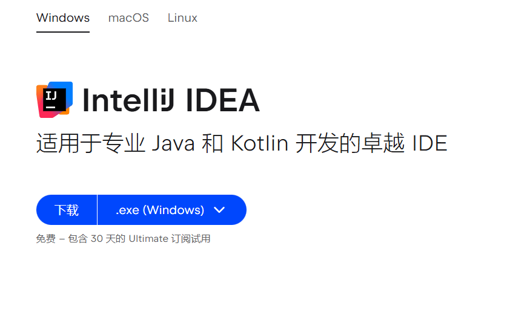
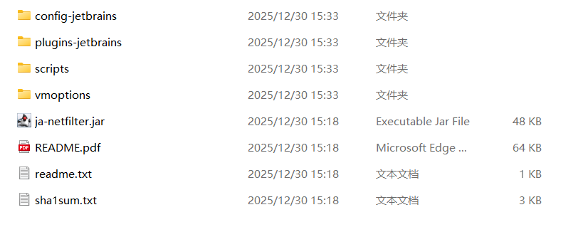
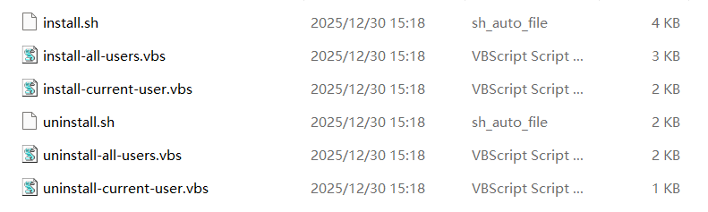
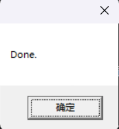
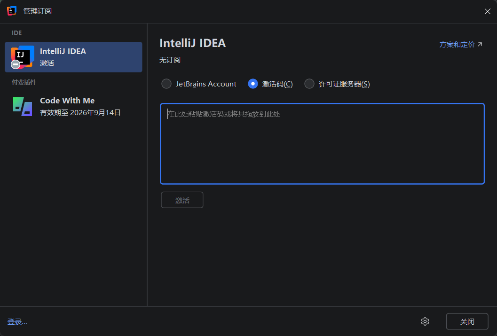

# Idea 2026 破解教程

## 下载安装 Idea 2026

推荐在官网 [下载 IntelliJ IDEA](https://www.jetbrains.com.cn/idea/download/?section=windows)



安装过程根据需要进行配置选择，在最后安装完成后先不运行。

## 运行脚本

点击 [下载激活脚本](./assets/@IdeaCrackTutorial/config-jetbrains.zip)。解压后得到如下结构：



进入 scripts 文件夹中：



点击运行 `install-current-user.vbs` 进行激活，页面出现弹窗：


点击 `确定`，过一会弹窗完成弹窗



如果长时间没有弹出，可以检测一下是否打开了 idea。

> 其他脚本可以为全部用户注册，或者注销用户注册。

## 激活

> > 断开网络

打开 idea 并进入激活页面：



复制以下内容并激活即可。

```txt
FV8EM46DQYC5AW9-eyJsaWNlbnNlSWQiOiJGVjhFTTQ2RFFZQzVBVzkiLCJsaWNlbnNlZU5hbWUiOiJtZW5vcmFoIHBhcmFwZXQiLCJsaWNlbnNlZVR5cGUiOiJQRVJTT05BTCIsImFzc2lnbmVlTmFtZSI6IiIsImFzc2lnbmVlRW1haWwiOiIiLCJsaWNlbnNlUmVzdHJpY3Rpb24iOiIiLCJjaGVja0NvbmN1cnJlbnRVc2UiOmZhbHNlLCJwcm9kdWN0cyI6W3siY29kZSI6IlBDV01QIiwiZmFsbGJhY2tEYXRlIjoiMjAyNi0wOS0xNCIsInBhaWRVcFRvIjoiMjAyNi0wOS0xNCIsImV4dGVuZGVkIjp0cnVlfSx7ImNvZGUiOiJQUlIiLCJmYWxsYmFja0RhdGUiOiIyMDI2LTA5LTE0IiwicGFpZFVwVG8iOiIyMDI2LTA5LTE0IiwiZXh0ZW5kZWQiOnRydWV9LHsiY29kZSI6IlBEQiIsImZhbGxiYWNrRGF0ZSI6IjIwMjYtMDktMTQiLCJwYWlkVXBUbyI6IjIwMjYtMDktMTQiLCJleHRlbmRlZCI6dHJ1ZX0seyJjb2RlIjoiUFNJIiwiZmFsbGJhY2tEYXRlIjoiMjAyNi0wOS0xNCIsInBhaWRVcFRvIjoiMjAyNi0wOS0xNCIsImV4dGVuZGVkIjp0cnVlfSx7ImNvZGUiOiJJSSIsImZhbGxiYWNrRGF0ZSI6IjIwMjYtMDktMTQiLCJwYWlkVXBUbyI6IjIwMjYtMDktMTQiLCJleHRlbmRlZCI6ZmFsc2V9XSwibWV0YWRhdGEiOiIwMjIwMjQwNzAyUFNBWDAwMDAwNVgiLCJoYXNoIjoiMTIzNDU2NzgvMC01NDE4MTY2MjkiLCJncmFjZVBlcmlvZERheXMiOjcsImF1dG9Qcm9sb25nYXRlZCI6ZmFsc2UsImlzQXV0b1Byb2xvbmdhdGVkIjpmYWxzZSwidHJpYWwiOmZhbHNlLCJhaUFsbG93ZWQiOnRydWV9-cH8qBniG31nF8954hthJJuzF6Fk4RQ9T03IfNxsFkuxUcwaAGHKOcRudvBZIAbLwDDFw63q2QZsnpwthBb/6IqBYnJrjRC83a8wkYKGN8HqAyDtbqdLOxLjcaiAiSKzektfAXn6nGNfDeygcFr/WzMfI0on/43ByuwxmSrjwYc4M8SCR0nkDAi0XwXNnFp3vSp0gJQd+lJtkSHO2KR7gUyNDZOPVduljJGbdLJUK6UcUjrlAd6NrTNqpu5P7hcYRaNzjoJ0KeIx5k9KmMCdcfQBia/zSHUbwZiecFsyjxqtIU0C3TDaX1OM4siJVDpgrXi+ocY86hiiYE79ygJf2IA==-MIIETDCCAjSgAwIBAgIBDTANBgkqhkiG9w0BAQsFADAYMRYwFAYDVQQDDA1KZXRQcm9maWxlIENBMB4XDTIwMTAxOTA5MDU1M1oXDTIyMTAyMTA5MDU1M1owHzEdMBsGA1UEAwwUcHJvZDJ5LWZyb20tMjAyMDEwMTkwggEiMA0GCSqGSIb3DQEBAQUAA4IBDwAwggEKAoIBAQCUlaUFc1wf+CfY9wzFWEL2euKQ5nswqb57V8QZG7d7RoR6rwYUIXseTOAFq210oMEe++LCjzKDuqwDfsyhgDNTgZBPAaC4vUU2oy+XR+Fq8nBixWIsH668HeOnRK6RRhsr0rJzRB95aZ3EAPzBuQ2qPaNGm17pAX0Rd6MPRgjp75IWwI9eA6aMEdPQEVN7uyOtM5zSsjoj79Lbu1fjShOnQZuJcsV8tqnayeFkNzv2LTOlofU/Tbx502Ro073gGjoeRzNvrynAP03pL486P3KCAyiNPhDs2z8/COMrxRlZW5mfzo0xsK0dQGNH3UoG/9RVwHG4eS8LFpMTR9oetHZBAgMBAAGjgZkwgZYwCQYDVR0TBAIwADAdBgNVHQ4EFgQUJNoRIpb1hUHAk0foMSNM9MCEAv8wSAYDVR0jBEEwP4AUo562SGdCEjZBvW3gubSgUouX8bOhHKQaMBgxFjAUBgNVBAMMDUpldFByb2ZpbGUgQ0GCCQDSbLGDsoN54TATBgNVHSUEDDAKBggrBgEFBQcDATALBgNVHQ8EBAMCBaAwDQYJKoZIhvcNAQELBQADggIBABKaDfYJk51mtYwUFK8xqhiZaYPd30TlmCmSAaGJ0eBpvkVeqA2jGYhAQRqFiAlFC63JKvWvRZO1iRuWCEfUMkdqQ9VQPXziE/BlsOIgrL6RlJfuFcEZ8TK3syIfIGQZNCxYhLLUuet2HE6LJYPQ5c0jH4kDooRpcVZ4rBxNwddpctUO2te9UU5/FjhioZQsPvd92qOTsV+8Cyl2fvNhNKD1Uu9ff5AkVIQn4JU23ozdB/R5oUlebwaTE6WZNBs+TA/qPj+5/we9NH71WRB0hqUoLI2AKKyiPw++FtN4Su1vsdDlrAzDj9ILjpjJKA1ImuVcG329/WTYIKysZ1CWK3zATg9BeCUPAV1pQy8ToXOq+RSYen6winZ2OO93eyHv2Iw5kbn1dqfBw1BuTE29V2FJKicJSu8iEOpfoafwJISXmz1wnnWL3V/0NxTulfWsXugOoLfv0ZIBP1xH9kmf22jjQ2JiHhQZP7ZDsreRrOeIQ/c4yR8IQvMLfC0WKQqrHu5ZzXTH4NO3CwGWSlTY74kE91zXB5mwWAx1jig+UXYc2w4RkVhy0//lOmVya/PEepuuTTI4+UJwC7qbVlh5zfhj8oTNUXgN0AOc+Q0/WFPl1aw5VV/VrO8FCoB15lFVlpKaQ1Yh+DVU8ke+rt9Th0BCHXe0uZOEmH0nOnH/0onD
```


到此激活完成。

## 参考

1. [IDEA2025 最新版安装配置（全网最简单）-CSDN 博客](https://blog.csdn.net/2301_80371894/article/details/145776977)
