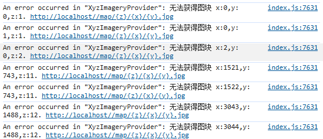

# Mars3d 基于 Nginx 支持多个瓦片图集

在基于 Mars3D 进行三维地图开发时，当需要加载多个瓦片图集时会出现无法同时加载的问题，如配置如下：

```js
const config = {
  basemaps: [
    {
      name: '瓦片1',
      id: 'wxt',
      type: 'xyz',
      url: `${import.meta.env.VITE_API_SOURCE_URL}/wxt/{z}/{x}/{y}.jpg`,
      minimumLevel: 0,
      maximumLevel: 20,
    },
    {
      name: '瓦片2',
      id: 'jy',
      type: 'xyz',
      url: `${import.meta.env.VITE_API_SOURCE_URL}/jy/{z}/{x}/{y}.jpg`,
      minimumLevel: 0,
      maximumLevel: 20,
    },
  ],
};
```

只会加载最后 `瓦片2` 的数据。

## nginx 配置实现多瓦片路由

假设资源路径如下：

```
source/
├── wxt/       # 第一优先级瓦片图集
│   └── 1/
│       └── 2/
│           └── 3.jpg
├── jy/        # 第二优先级瓦片图集
│   └── 1/
│       └── 2/
│           └── 3.jpg
└── empty.jpg  # 兜底空图片
```

配置 `nginx` 核心代码如下：

```nginx
# 匹配/map开头的瓦片请求，转发到多图集目录
location ~ ^/map/(.*)$ {
    # 瓦片文件根目录（根据实际部署路径调整）
    root source;
    # 优先级匹配：先匹配wxt图集 → 再匹配jy图集 → 最后返回空图片兜底
    try_files /wxt/$1 /jy/$1 /empty.jpg;
    # 可选：添加缓存头，提升瓦片加载性能
    add_header Cache-Control "public, max-age=86400";
    # 可选：解决跨域问题
    add_header Access-Control-Allow-Origin *;
}
```

> `^/map/(.*)$`：匹配所有以`/map/`开头的请求，`$1`捕获请求路径中`/map/`后的所有内容（如`/map/1/2/3.png` → `$1=1/2/3.png`）；

> `root source`：指定瓦片文件的根目录为 `nginx` 部署目录下的`source`文件夹；

> `try_files`：按顺序检查文件是否存在： 先检查`source/wxt/$1`（政务瓦片目录）； 不存在则检查`source/jy/$1`（集约瓦片目录）； 均不存在则返回`source/empty.jpg`（空图片，避免 404）；

## 更新 mars3d 地图配置

修改 mars3d 地图配置，让前端对地图瓦片的请求统一通过 map 路径获取：

```js
const config = {
  basemaps: [
    {
      name: '瓦片1',
      id: 'wxt',
      type: 'xyz',
      url: `${import.meta.env.VITE_API_SOURCE_URL}/map/{z}/{x}/{y}.jpg`,
      minimumLevel: 0,
      maximumLevel: 20,
    },
  ],
};
```

## 处理瓦片图错误输出

虽然 nginx 有兜底空图片，请求不会出错，但是 mars3d 会在控制台输出瓦片错误信息：



使用重写 `console.log` 函数筛选出该信息并隐藏：

```js
const log = window.console.log;
window.console.log = (...args) => {
  // 过滤掉 Mars3D 的瓦片错误
  if (args[0] && typeof args[0] === 'string') {
    if (args[0].startsWith('An error occurred in "XyzImageryProvider": 无法获得图块')) {
      // 静默处理，不输出
      return;
    }
  }
  // 其他错误正常输出
  log.apply(window.console, args);
};
```
