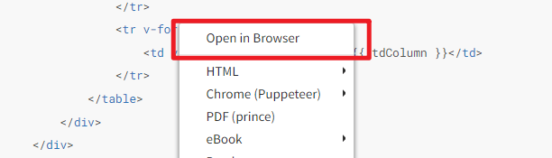
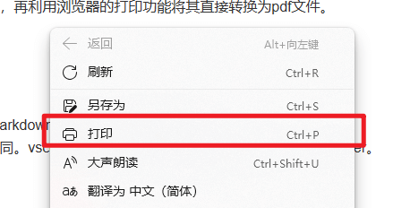
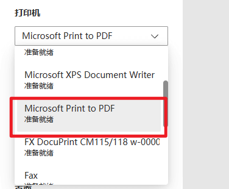
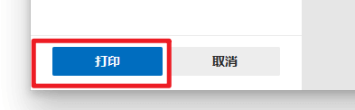

# md 文档转 pdf

## 原理

通过 md 查看工具将其在浏览器中渲染出来，再利用浏览器的打印功能将其直接转换为 pdf 文件。

## 实现

1. 打开 md，这里使用 vscode 并安装了 Markdown Preview Enhanced 插件。

2. 在浏览器中预览 md，不同软件方式不同。vscode 中在预览中点击鼠标右键选择 Open in Browser。

3. 在浏览器中右键选择打印

4. 在弹出的打印页面中选择 Microsoft Print to PDF 作为打印机

5. 点击打印，选择保存路径即可

