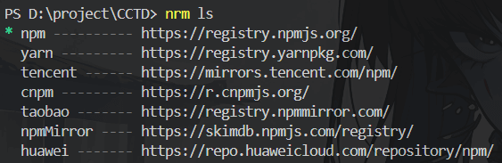
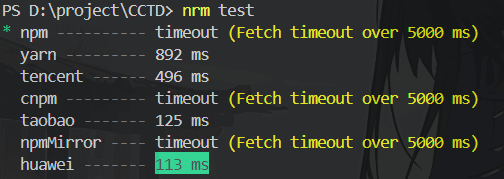

# NRM - NPM 的镜像源管理工具

NRM 是一个 NPM 源管理器，它可以帮助用户轻松地在不同的 NPM 源之间切换。它支持多种源，包括 npm、cnpm、taobao、yarn、tencent、npmMirror 和 huawei 等。通过使用 nrm，用户可以快速地更改 NPM 的源，以提高包的下载速度或解决某些包在特定源上无法下载的问题。

## 安装

推荐全局安装

```shell title="hidden"
npm install -g nrm
```

## 常用命令

- 列出所有可用的源，星号 (\*) 表示当前使用的源。

```shell title="hidden"
nrm ls
```



- 切换到指定的源。

```shell title="hidden"
nrm use <registry>
```

- 添加一个新的自定义源。

```shell title="hidden"
nrm use <registry> <url>
```

- 删除一个已存在的源。

```shell title="hidden"
nrm del <registry>
```

- 测试所有源的响应时间，以帮助选择最快的源。

```shell title="hidden"
nrm test
```


