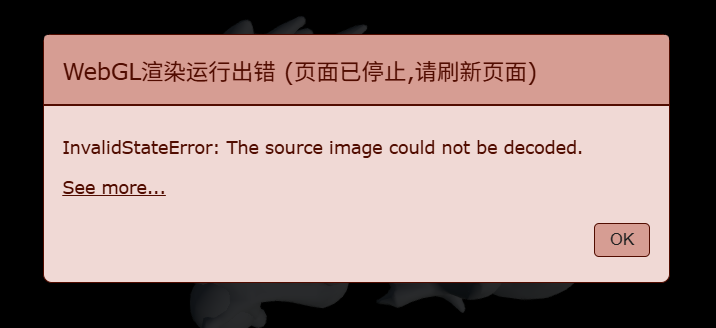

# 关于 Mars3d 的一些问题处理

## InvalidStateError: The source image could not be decoded.



原因大概率是 vite 项目没配置 vite-plugin-cesium 插件。

```shell
npm install vite-plugin-cesium
```

```js title=vite.config.js
import { defineConfig } from 'vite';
import vue from '@vitejs/plugin-vue';
import cesium from 'vite-plugin-cesium';

export default defineConfig({
  plugins: [vue(), cesium()],
  //...
});
```

## CurveEntity 不支持 3D 曲线

在文档 [CurveEntity - V3.10.8 - Mars3D API 文档](http://mars3d.cn/api/CurveEntity.html) 中有： `曲线 (内置turf.bezierSpline算法，不支持高度，如需支持需要改动turf的高度值插值曲线)`。可以使用支持高度的 `PolylineEntity` 结合密集点来实现。

- 先实现三维曲线点获取方法

```js title=get3DSmoothPotions.js
/**
 * 修复版B样条曲线生成（解决NaN问题）
 * @param {Array} points 三维点数组，每个点格式为 [x, y, z]
 * @param {Number} [degree=3] 曲线阶数（2=二次，3=三次，最大不超过点数量-1）
 * @param {Number} [segments=30] 每个区间的插值点数
 * @returns {Array} 光滑曲线的坐标集合
 */
export default function (points, degree = 3, segments = 30) {
  // 输入验证
  if (!points || !Array.isArray(points) || points.length < 2) {
    return points;
  }
  if (degree < 1 || degree >= points.length) {
    degree = points.length - 1;
  }

  const n = points.length; // 控制点数量
  const p = degree; // 曲线阶数（次数）
  const m = n + p + 1; // 节点数量（标准B样条节点公式）

  // 生成标准均匀节点向量（两端重复p+1次）
  const knots = [];
  // 起点重复段
  for (let i = 0; i <= p; i++) knots.push(0);
  // 中间均匀段
  const middleCount = m - 2 * (p + 1);
  for (let i = 1; i <= middleCount; i++) {
    knots.push(i / (middleCount + 1));
  }
  // 终点重复段
  for (let i = 0; i <= p; i++) knots.push(1);

  // 计算曲线点
  const curvePoints = [];
  const totalSegments = (n - p) * segments; // 总采样段数
  const step = 1 / totalSegments;

  // 在[0, 1]区间内均匀采样（避开节点重复区域）
  for (let s = 0; s <= 1; s += step) {
    // 确保最后一个点精确为1
    const t = s > 1 ? 1 : s;
    const point = calculateBSplinePoint(t, points, knots, p);
    curvePoints.push(point);
  }

  return curvePoints;
}

/**
 * 计算B样条曲线上的点（修复索引和除零问题）
 */
function calculateBSplinePoint(t, points, knots, p) {
  const n = points.length;
  const m = knots.length;
  let i;

  // 找到t所在的区间索引（修复边界判断）
  if (t === 1) {
    // 特殊处理终点，避免索引越界
    i = m - p - 2;
  } else {
    // 找到合适的区间
    for (i = p; i < m - p - 1; i++) {
      if (t >= knots[i] && t < knots[i + 1]) {
        break;
      }
    }
  }

  // 计算基函数（使用De Boor-Cox公式，增加除零保护）
  const basis = new Array(p + 1).fill(0);
  for (let k = 0; k <= p; k++) {
    basis[k] = basisFunction(i - k, p, t, knots);
  }

  // 计算加权点（确保索引有效）
  let x = 0,
    y = 0,
    z = 0;
  for (let k = 0; k <= p; k++) {
    const idx = i - p + k;
    if (idx >= 0 && idx < n) {
      // 索引安全检查
      x += basis[k] * points[idx][0];
      y += basis[k] * points[idx][1];
      z += basis[k] * points[idx][2];
    }
  }

  return [x, y, z];
}

/**
 * 基函数计算（增加除零保护）
 */
function basisFunction(i, p, t, knots) {
  if (p === 0) {
    // 0阶基函数：判断t是否在区间内
    return (t >= knots[i] && t < knots[i + 1]) || (t === knots[i + 1] && t === knots[knots.length - 1]) ? 1 : 0;
  }

  const denom1 = knots[i + p] - knots[i];
  const denom2 = knots[i + p + 1] - knots[i + 1];

  let a = 0,
    b = 0;
  // 增加除零保护
  if (denom1 !== 0) {
    a = ((t - knots[i]) / denom1) * basisFunction(i, p - 1, t, knots);
  }
  if (denom2 !== 0) {
    b = ((knots[i + p + 1] - t) / denom2) * basisFunction(i + 1, p - 1, t, knots);
  }

  return a + b;
}
```

- 在 `PolylineEntity` 中使用

```js
map = new mars3d.Map('mars3dContainer', mapConfig);
// 创建光滑的 PolylineEntity
const polylineEntity = new mars3d.graphic.PolylineEntity({
  positions: get3DSmoothPotions([
    [103.5, 30.5, 20],
    [103.5, 30.2, 20000],
    [103.0, 30.6, 0],
    [103.6, 30.7, 100],
  ]),
  style: {
    width: 6,
    opacity: 0.8,
    color: '#9a8',
  },
});

// 添加到地图
map.graphicLayer.addGraphic(polylineEntity);
map.flyToGraphic(polylineEntity);
```

## 去除点击时地图的黑色边框

点击前:  
 点击后出现黑色边框:  


这是因为 `canvas` 的 `outline` 所致。

```html
<div id="mars3dContainer" class="mainMap"></div>
```

```css
#mars3dContainer canvas {
  outline: none;
}
```

## 参考

1. [Cesium 报错 InvalidStateError: The source image could not be decoded.-CSDN 博客](https://blog.csdn.net/iUtaoki/article/details/151576497)
