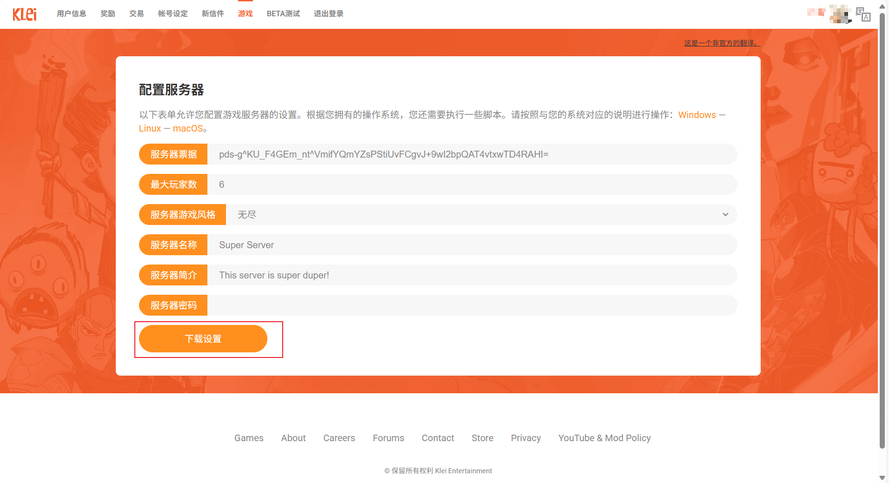
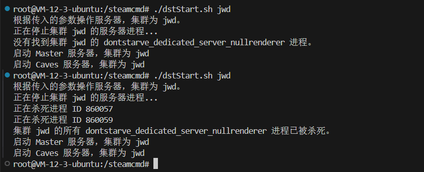

# Linux-Ubuntu 云服务器搭建饥荒服务器

该教程服务器搭建与 `Ubuntu` 下，也可以使用其他环境。不过想要注意查看服务器是否支持 32 位库（阿里云的 Alibaba Cloud Linux 服务器不支持），因为饥荒服务器想要一些 32 位库才可以运行。如果发现服务器不支持建议更换镜像。


> 该教程在 root 用户下进行搭建，所以一些权限问题（如使用 sudo 等）请自行解决。

## 服务器选择

饥荒服务器地上和洞穴是两个服务器，使用一些模组把地下生态系统可以搬到地上，或者不要洞穴等方法可以只要一个服务器，可以使用 2G 的服务器。其他情况都强烈建议使用 4G 服务器。

## 搭建服务器

### 安装依赖

更新源

```shell
add-apt-repository multiverse
dpkg --add-architecture i386
apt-get -y update
```

下载依赖

```shell
apt-get -y install lib32gcc-s1 libstdc++6:i386 libgcc1:i386 libcurl4-gnutls-dev:i386
```

有些源里可能没有 libcurl4-gnutls-dev，需要直接安装：

```shell
cd /usr/lib/
ln -s libcurl.so.4 libcurl-gnutls.so.4
```

### 安装 steamCmd

这里直接安装到 `/steamcmd` 下

```shell
mkdir -p /steamcmd
cd /steamcmd
curl -sqL "https://steamcdn-a.akamaihd.net/client/installer/steamcmd_linux.tar.gz" | tar zxvf -
```

### 安装饥荒联机版

在 steamcmd 安装路径下，进入 steamcmd

```shell
./steamcmd.sh
```

设置安装路径并安装，这里可能比较慢。

```shell
force_install_dir ./dontstarvetogether
login anonymous
app_update 343050 validate
quit
```

> 这里表示安装到 /steamcmd/dontstarvetogether 下。

### 创建饥荒存档

创建服务器想要一个 token。登录[https://accounts.klei.com/login](https://accounts.klei.com/login)，这里可能想要科学上网。


登录好后在游戏中选择饥荒游戏服务器


添加新服务器(如果没有的话)。


点击配置服务器，输入相关信息点击下载得到一个存档 zip 包。



将下载的存档包解压并上传到服务器，建议先放到 `/steamcmd/DoNotStarveTogether/clusters` 下后面脚本需要路径，后续可自行修改。上传到服务器的方法可以参考[Vscode 免密连接远程 ssh](./VsSecretFreeSsh.html)，或者使用其他办法。上传之后应该会有 `/steamcmd/DoNotStarveTogether/clusters/MyDediServer` 目录。

### 启动/停止脚本

在任意地方创建 `dstStart.sh` 文件并写入以下内容：

```sh title=dstStart.sh
#!/bin/bash

# 饥荒安装路径
game_home=/steamcmd/dontstarvetogether
# 存档路径
game_config_dir=/steamcmd/DoNotStarveTogether
# 启动日志输出路径
game_log_path=/steamcmd

# 结束指定集群的进程
stop_server() {
    cluster=$1
    echo "正在停止集群 $cluster 的服务器进程..."

    # 使用 ps 和 grep 查找与指定集群相关的 dontstarve_dedicated_server_nullrenderer 进程
    # 使用 -- 来分隔选项和搜索模式
    PIDS=$(ps -ef | grep './dontstarve_dedicated_server_nullrenderer' | grep -- "-cluster $cluster" | grep -v grep | awk '{print $2}')

    # 检查是否找到进程
    if [ -z "$PIDS" ]; then
        echo "没有找到集群 $cluster 的 dontstarve_dedicated_server_nullrenderer 进程。"
    else
        # 遍历所有找到的进程并杀死它们
        for PID in $PIDS; do
            echo "正在杀死进程 ID $PID"
            kill -9 $PID
        done
        echo "集群 $cluster 的所有 dontstarve_dedicated_server_nullrenderer 进程已被杀死。"
    fi
}

# 启动服务器的函数
start_server() {
    shard=$1
    cluster=$2
    echo "启动 $shard 服务器，集群为 $cluster"
    cd "$game_home"/bin
    run_command=(./dontstarve_dedicated_server_nullrenderer)
    run_command+=(-console)
    run_command+=(-persistent_storage_root "$game_config_dir")
    run_command+=(-conf_dir clusters)
    run_command+=(-cluster "$cluster")
    run_command+=(-shard "$shard")

    mkdir -p "$game_log_path"
    "${run_command[@]}" >"$game_log_path"/log_$shard.log 2>&1 &
}

# 检查是否有参数传入
if [ $# -eq 0 ]; then
    echo "没有传入参数，必须指定 -cluster 参数。"
    exit 1
else
    # 第一个参数为 -cluster 的值
    cluster=$1
    echo "根据传入的参数操作服务器，集群为 $cluster。"

    # 先停止指定集群的服务器
    stop_server "$cluster"

    # 启动指定集群的服务器
    start_server Master "$cluster"
    start_server Caves "$cluster"
fi
```

给予执行权限

```sh
chmod +x dstStart.sh
```

启动命令

```sh
./dstStart.sh MyDediServer
```

> 这里的 MyDediServer 为存档文件夹名，可以修改。在启动时会先停止之前的 MyDediServer 服务器再重新启动。

运行参考



这部分为最关键的代码，理解这部分就可以自行修改目录与代码了：

```sh
# 进入游戏的bin目录
cd "$game_home"/bin
# 执行服务，并添加参数
run_command=(./dontstarve_dedicated_server_nullrenderer)
# 开启控制台输出
run_command+=(-console)
# 这里表示存档根目录，需要多一级是因为会在该目录下生成Agreements目录
run_command+=(-persistent_storage_root "$game_config_dir")
# 多个存档的存放路径名
run_command+=(-conf_dir clusters)
# 存档文件名，如刚刚运行的 MyDediServer
run_command+=(-cluster "$cluster")
# 这里可以为 Master 和 Caves 表示地上和洞穴
run_command+=(-shard "$shard")
```

启动的日志文件与 `dstStart.sh` 同级，名为 `log_Master.log` 和 `log_Caves.log`。

将启动代码中的停止部分提取出来做一个停止服务器的脚本文件：

```sh title=dstStop.sh
#!/bin/bash

game_home=/steamcmd/dontstarvetogether
game_config_dir=/steamcmd/DoNotStarveTogether
game_log_path=/steamcmd

# 结束指定集群的进程
stop_server() {
    cluster=$1
    echo "正在停止集群 $cluster 的服务器进程..."

    # 使用 ps 和 grep 查找与指定集群相关的 dontstarve_dedicated_server_nullrenderer 进程
    # 使用 -- 来分隔选项和搜索模式
    PIDS=$(ps -ef | grep './dontstarve_dedicated_server_nullrenderer' | grep -- "-cluster $cluster" | grep -v grep | awk '{print $2}')

    # 检查是否找到进程
    if [ -z "$PIDS" ]; then
        echo "没有找到集群 $cluster 的 dontstarve_dedicated_server_nullrenderer 进程。"
    else
        # 遍历所有找到的进程并杀死它们
        for PID in $PIDS; do
            echo "正在杀死进程 ID $PID"
            kill -9 $PID
        done
        echo "集群 $cluster 的所有 dontstarve_dedicated_server_nullrenderer 进程已被杀死。"
    fi
}

# 检查是否有参数传入
if [ $# -eq 0 ]; then
    echo "没有传入参数，必须指定 -cluster 参数。"
    exit 1
else
    # 第一个参数为 -cluster 的值
    cluster=$1
    echo "根据传入的参数操作服务器，集群为 $cluster。"

    # 先停止指定集群的服务器
    stop_server "$cluster"
fi
```

### 可能出现的问题

#### 缺失 libcurl-gnutls.so.4

报错信息如下:

```sh
./dontstarve_dedicated_server_nullrenderer: error while loading shared libraries: libcurl-gnutls.so.4: cannot open shared object file: No such file or directory
```

建立软连接即可解决

```sh
ln -s /usr/lib/libcurl.so /usr/lib/libcurl-gnutls.so.4
```

#### 缺失 libstdc++.so.6

报错信息如下:

```sh
./dontstarve_dedicated_server_nullrenderer: error while loading shared libraries: libstdc++.so.6: cannot open shared object file: No such file or directory
```

复制 steamcmd 的 linux32 文件夹下的包即可

```sh
cp ./linux32/libstdc++.so.6 /usr/lib
```

### 存档更换

可以将本地的存档直接覆盖服务器存档并保留 `cluster_token.txt` 文件即可。也可以多添加存档文件夹来启动不同服务器。

## mod 安装

打开地上 mod 配置文件： `/steamcmd/DoNotStarveTogether/clusters/MyDediServer/Master/modoverrides.lua` 如下：

```lua title="modoverrides.lua"
return {
  ["workshop-1185229307"]={
    configuration_options={
      CAMERA=true,
      CAPTURE=false,
      DAMAGE_NUMBERS=true,
      DAMAGE_RESISTANCE=true,
      FRAME_PHASES=true,
      GLOBAL=false,
      GLOBAL_NUMBERS=false,
      HEADER_CLIENT=false,
      HEADER_SERVER=false,
      HORIZONTAL_OFFSET=0,
      TAG="EPIC",
      TRANSLATOR=false,
      WETNESS_METER=false
    },
    enabled=true
  },
  ["workshop-1216718131"]={ configuration_options={ clean=true, lang=true, stack=true }, enabled=true },
  ["workshop-1894295075"]={ configuration_options={  }, enabled=true }
}
```

打开 mod 服务文件：`/steamcmd/dontstarvetogether/mods/dedicated_server_mods_setup.lua`，其中全为注释（可以删除），写入以下内容：

```lua title="dedicated_server_mods_setup.lua"
ServerModSetup("1185229307")
ServerModSetup("1216718131")
ServerModSetup("1894295075")
```

一个 mod 就写一个 `ServerModSetup`。在启动服务器的时候会自动下载。

## 连接服务器

### 查看存档端口

分别打开以下文件查看端口号:

```sh
/steamcmd/DoNotStarveTogether/clusters/MyDediServer/Master/server.ini
```

```sh
/steamcmd/DoNotStarveTogether/clusters/MyDediServer/Caves/server.ini
```

内容如下：

```ini title=server.ini
[NETWORK]
server_port = 10998


[SHARD]
is_master = false
name = Caves
id = 1256765674


[ACCOUNT]
encode_user_path = true


[STEAM]
master_server_port = 27017
authentication_port = 8767
```

其中端口号为 `server_port` 后面的 `10998`

### 设置云服务器防火墙

登录自己的云服务器控制台，找到防火墙面板添加对应的端口。


> 多个服务器需要开放多个端口。协议需要选择 UDP。

### 进入游戏

可以在游戏内直接搜索房间名称，游戏名称可以设置文件中查看设置：

```sh
/steamcmd/DoNotStarveTogether/clusters/MyDediServer/cluster.ini
```

也可以使用直连代码进行连接：`c_connect(ip, 端口, 密码)`，如

```sh
c_connect("28.156.15.22", 10889, 1233211234567)
```

## 参考
