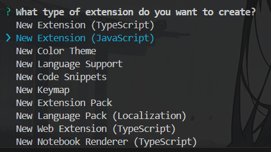
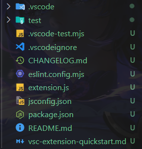
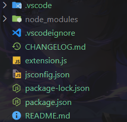
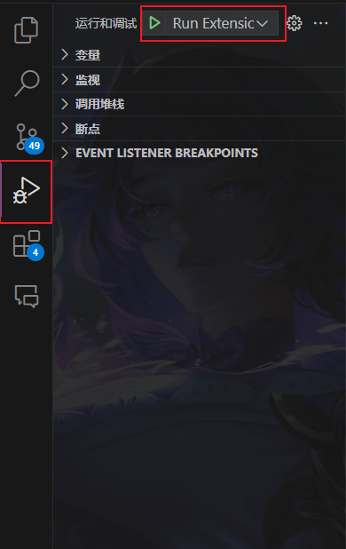

# Vscode 插件基础开发

VS Code 插件（也称为扩展）是基于 Node.js 的轻量级应用程序，用于扩展 VS Code 的功能。插件可以实现多种功能，例如：

- 语言支持：为特定编程语言提供语法高亮、代码补全、调试工具等。

- 工具集成：集成外部工具，如 Git、Docker、Linter 等。

- 主题和样式：自定义编辑器的外观，包括颜色主题和图标。

- 工作流优化：通过快捷键、命令或自动化任务简化开发流程。

开发工具与环境：

- Node.js：VS Code 插件基于 Node.js 运行，因此需要安装 Node.js 环境。

- VS Code：开发插件的最佳工具就是 VS Code 本身。它提供了插件开发的内置支持，包括调试工具和扩展生成器。

## 创建项目

1. 下载 Yeoman 代码生成器

```bash
npm install -g yo generator-code
```

2. 生成项目

```bash
yo code
```

这里选择普通的 js 项目



选择完全部选项后会在当前目录下生成一个插件文件夹，项目结构如下：



去除一些非必须的文件(夹)后：



## package.json 插件配置

在 package.json 内容如下：

```json
{
  "name": "myextension", // 插件项目名
  "displayName": "myExtension", // 显示的插件名称
  "description": "", // 插件描述
  "version": "0.0.1", // 版本
  // 环境依赖
  "engines": {
    "vscode": "^1.98.0"
  },
  "categories": ["Other"], // 分类
  "activationEvents": ["onStartupFinished"], // 激活事件，插件默认是不会激活的
  "main": "./extension.js", // 插件程序入口文件
  // 贡献
  "contributes": {
    "commands": [
      // 指令贡献，当运行指令时会自动激活插件
      {
        "command": "myextension.helloWorld",
        "title": "Hello World"
      }
    ]
  },
  // 脚本代码
  "scripts": {
    "lint": "eslint .",
    "pretest": "npm run lint",
    "test": "vscode-test"
  },
  // 依赖
  "devDependencies": {
    "@types/vscode": "^1.98.0",
    "@types/mocha": "^10.0.8",
    "@types/node": "20.x",
    "eslint": "^9.11.1",
    "@vscode/test-cli": "^0.0.10",
    "@vscode/test-electron": "^2.4.1"
  }
}
```

> 在 `activationEvents` 中加入 `onStartupFinished`，在 VS Code 启动后激活插件。全部激活事件可以查看 [激活事件 |Visual Studio Code 扩展 API](https://code.visualstudio.com/api/references/activation-events)

## 入口文件

再看入口文件`extension.js`，其中暴露了两个函数：

- active：注册插件时运行
- deactivate：注销插件时运行

在 active 中自动生成了如下代码：

```js
const disposable = vscode.commands.registerCommand('myextension.helloWorld', function () {
  vscode.window.showInformationMessage('Hello World from myExtension!');
});

context.subscriptions.push(disposable);
```

- `vscode.commands.registerCommand` 创建指令，指令需要在贡献存在。
- `vscode.window.showInformationMessage` 在 VS Code 中显示消息。
- `context.subscriptions.push` 将创建的指令注册到 Vs Code 指令集中。

## 运行项目

在 VS Code 中打开插件目录，按下 `F5` 后 VS Code 会打开一个新窗口并在新窗口中运行插件。

如果在多项目的工作区中，可以 `运行与调试` 面板中选择对应的：



启动插件后，按下 `shift + ctrl + p` 输入 `Hello World` 指令会向用户发送信息。


## 项目打包

这里只是创建了基础的插件，在经过更为复制的开发后进行项目打包。

运行 `vsce package` 命令即可进行打包。但是可以会出现以下问题：

1. ` ERROR It seems the README.md still contains template text. Make sure to edit the README.md file before you package or publish your extension.`。这是因为没有修改 README.md 文件导致的。解决方法是编辑 README.md 文件，或删除模板内容。
2. `A 'repository' field is missing from the 'package.json' manifest file. Use --allow-missing-repository to bypass.`。缺失 repository 字段导致的。可以添加 repository 字段或者添加运行参数 `vsce package --allow-missing-repository`。
3. `LICENSE, LICENSE.md, or LICENSE.txt not found`。缺失 LICENSE 文件。可以添加 LICENSE 文件或者直接忽略。

最总会在项目下出现 `myextension-0.0.1.vsix` 插件文件，文件名取决于插件项目名称和版本。右键插件文件选择 `安装扩展` 可以直接安装。

## 参考

[Extension API | Visual Studio Code Extension API](https://code.visualstudio.com/api/)
