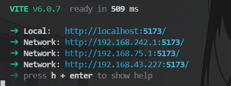

# Vite 配置一览

常用配置如下：

```js title=vite.config.js
import { defineConfig } from 'vite';
import vue from '@vitejs/plugin-vue';
import path from 'path';

export default defineConfig({
  // 插件配置
  plugins: [
    vue(), // 使用 Vue 插件，支持 Vue 3
  ],

  // 基本配置
  base: './', // 设置项目的 base URL，默认是 './'，用于部署到子路径
  publicDir: 'public', // 设置静态资源目录，默认是 'public'

  // 服务器配置
  server: {
    port: 3000, // 设置开发服务器的端口号
    open: true, // 自动打开浏览器
    host: 'localhost', // 设置服务器的主机名，允许外部访问
    proxy: {
      // 设置代理，解决开发环境下的跨域问题
      '/api': {
        target: 'http://example.com', // 目标服务器地址
        changeOrigin: true, // 是否改变请求的 origin
        rewrite: (path) => path.replace(/^\/api/, ''), // 重写路径
      },
    },
  },

  // 构建配置
  build: {
    outDir: 'dist', // 构建输出目录
    assetsDir: 'assets', // 静态资源目录
    target: 'es2015', // 构建目标浏览器环境
    minify: 'esbuild', // 使用 esbuild 进行代码压缩
    chunkSizeWarningLimit: 500, // 警告 chunk 大小的限制
    rollupOptions: {
      // Rollup 配置
      output: {
        manualChunks: {
          // 手动分包
          vendor: ['vue', 'vue-router'], // 将这些依赖打包到一个单独的 chunk 中
        },
      },
    },
  },

  // 路径别名配置
  resolve: {
    alias: {
      '@': path.resolve(__dirname, './src'), // 设置 '@' 别名指向项目根目录下的 src 文件夹
      '@assets': path.resolve(__dirname, './src/assets'), // 设置 '@assets' 别名指向 assets 文件夹
    },
  },

  // 环境变量配置
  envPrefix: 'VITE_', // 设置环境变量的前缀，默认是 'VITE_'

  // 自定义配置
  define: {
    __APP_VERSION__: '1.0.0', // 自定义全局变量
  },
});
```

## base

默认情况下，`base` 的值是 `/`，表示项目位于服务器的根路径。如：`http://example.com/`。 如果需要在 `https://example.com/subpath/` 下访问项目，只需要将 `base` 设置为 `/subpath/`;

```js vite.config.js
export default defineConfig({
  base: '/subpath/',
});
```

## server.host

`server.host` 用于控制开发服务器的主机名。默认情况下绑定到 `localhost`，这意味着它只能在本地机器上访问。通过设置 `server.host` 可以允许从其他设备访问开发服务器，或者绑定到特定的 IP 地址。

#### 设置为 true

让开发服务器绑定到所有网络接口，常常为了在同一局域网的其他设备能够访问。

```js vite.config.js
export default defineConfig({
  server: {
    host: true,
  },
});
```



#### 特定的 IP 地址

如果你的开发环境有特定的网络配置，需要绑定到某个特定的 IP 地址，可以将 server.host 设置为该 IP 地址。

```js vite.config.js
export default defineConfig({
  server: {
    host: '192.168.1.100',
  },
});
```

## server.proxy

`server.proxy` 配置会在本地开启一个代理服务器进行请求转发，从而解决跨域问题。

```js title=vite.config.js
export default defineConfig({
  server: {
    proxy: {
      '/api': {
        target: 'http://example.com', // 后端服务器的地址
        changeOrigin: true, // 是否改变请求的 origin
        rewrite: (path) => path.replace(/^\/api/, ''), // 重写路径
      },
    },
  },
});
```

> 当请求目标地址是 `http://example.com/geturl`，在项目请求地址为 `/api/geturl`。

## build.target

`build.target` 指定构建输出的目标浏览器环境。决定了构建过程中使用的 `JavaScript` 和 `CSS` 的兼容性级别，以确保生成的代码可以在指定的浏览器环境中正常运行。

`build.target` 的默认值为 `modules`，表示生成的代码将使用 ES 模块语法，并且不会进行额外的兼容性转换。如果兼容是现代浏览器，可以使用默认值或者设置为 `es2015` 或更高版本。[版本查看](https://esbuild.github.io/content-types/)

```js title=vite.config.js
export default defineConfig({
  build: {
    target: 'es2015',
  },
});
```

> 设置的版本越高，打包体积越小，兼容性越差。

## build.minify

`build.minify` 指定构建过程中代码的压缩方式。只可以设置为以下值：

- false：禁用代码压缩，SSR 默认值。
- 'terser'：使用 Terser 进行代码压缩。
- 'esbuild'：使用 esbuild 进行代码压缩，客户端默认值。

> esbuild 的速度比 Terser 快 20 到 40 倍，压缩率仅降低 1 到 2%。

## build.chunkSizeWarningLimit

`build.chunkSizeWarningLimit` 用于设置触发警告的 `chunk` 大小限制（以 KB 为单位）。默认值是 500 KB。

> 在 Vite（以及 Webpack 和其他构建工具）中，`chunk` 是指构建过程中生成的代码块。每个 `chunk` 包含了一部分代码，这些代码可以是模块、依赖项或其他资源。当你的项目构建时，代码会被分割成多个 `chunk`，以便在浏览器中加载。

## resolve.alias

`resolve.alias` 用于设置路径别名。路径别名可以在项目中使用简短的路径引用文件，从而提高代码的可读性和可维护性。

```js title=vite.config.js
export default defineConfig({
  resolve: {
    alias: {
      '@': path.resolve(__dirname, './src'),
      '@assets': path.resolve(__dirname, './src/assets'),
      '@components': path.resolve(__dirname, './src/components'),
    },
  },
});
```

当访问以下文件时

```js
import variables from '@/styles/variables.scss';
import logo from '@assets/logo.png';
import MyComponent from '@components/MyComponent.vue';
```

等同于

```js
import variables from '/src/styles/variables.scss';
import logo from '/src/assets/logo.png';
import MyComponent from '/src/components/MyComponent.vue';
```

## define

`define` 选项允许定义全局变量，这些变量可以在项目代码中直接使用，而无需额外的导入。

```js title=vite.config.js
import { defineConfig } from 'vite';

export default defineConfig({
  define: {
    __APP_VERSION__: '1.0.0',
    __API_URL__: 'http://example.com/api',
    __IS_PRODUCTION__: process.env.NODE_ENV === 'production',
  },
});
```

```js
console.log(__APP_VERSION__); // 输出: 1.0.0
console.log(__API_URL__); // 输出: http://example.com/api
console.log(__IS_PRODUCTION__); // 输出: true 或 false
```

> `define` 中的值必须是字符串、数字、布尔值等基本类型。如果需要定义对象或数组，可以使用 `JSON.stringify` 将其转换为字符串。

## 参考

[配置 Vite | Vite 官方中文文档](https://vitejs.cn/vite3-cn/config/)  
[esbuild - Content Types](https://esbuild.github.io/content-types/)
