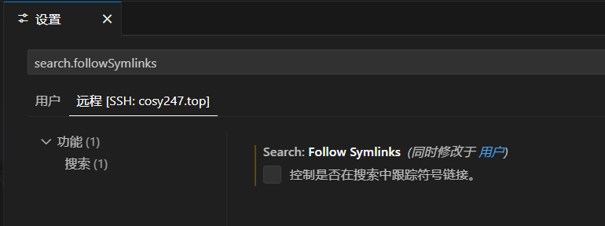

# Vscode 连接服务器导致服务器卡死

在通过 Vscode 的 Remote-SSH 插件连接远程服务器时（这里使用的是阿里云云服务器），会在连接后一段时间卡死，检查服务器为 cpu 使用率 100%。

## 解决

在 Vscode 的设置里面搜索 `search.followSymlinks`，并将设置关闭掉。

可以在远程 tab 中单独关闭，也可以在用户 tab 中设置全部关闭。
