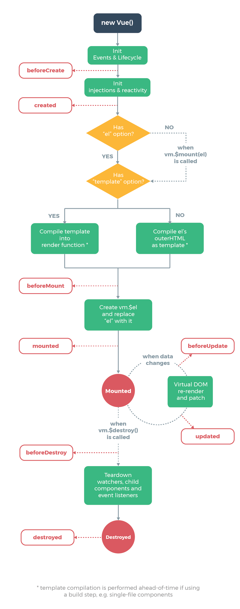

# Vue 杂记

## MVC 和 MVVM 模型

**MVC（模型-视图-控制器**

- **Model**：负责数据存储。
- **View**：负责数据的展示。
- **Controller**：处理用户操作，更新视图。

在 MVC 模型中，`Controller` 直接处理用户的操作，并将处理结果更新到视图上。用户操作信息会传递到 `Controller`，然后 `Controller` 处理这些信息，并反映到视图中（如果有需要）。

**MVVM（模型-视图-视图模型）**

- **Model**：负责数据存储。
- **View**：负责数据展示。
- **ViewModel**：作为 Model 和 View 之间的桥梁，实现数据的双向绑定。

在 MVVM 模型中，`ViewModel` 充当 `Model` 和 `View` 之间的中介，`View` 和 `Model` 不能直接交互。`ViewModel` 通过数据的双向绑定来更新视图。用户在 `View` 上的操作会更新 `Model` 中的数据，而 `ViewModel` 会监听 `Model` 的数据变化，自动更新视图。

## SPA（单页面应用）与 MPA（多页面应用）

### SPA（单页面应用）

- **特点**：通过动态重写当前页面来与用户交互，避免页面间切换带来的体验中断。所有必要的代码（HTML、JavaScript 和 CSS）都通过单个页面的加载而获取，或者根据需要动态加载资源。
- **技术栈**：React、Vue、Angular、Ember 等。
- **优点**：页面切换速度快，用户体验良好。
- **缺点**：初次加载较慢，SEO 实现较难。

### MPA（多页面应用）

- **特点**：每个页面都是一个独立的主页面，访问不同页面时需要重新加载 HTML、CSS 和 JavaScript 文件。
- **优点**：首次加载速度较快，SEO 实现较为容易。
- **缺点**：页面间切换时资源重复加载，用户体验较差。

### SPA 与 MPA 对比

|          | SPA                      | MPA                            |
| -------- | ------------------------ | ------------------------------ |
| 组成     | 一个主页面和多个页面片段 | 多个独立主页面                 |
| 刷新方式 | 局部刷新                 | 整页刷新                       |
| URL 模式 | 哈希模式/历史模式        | 历史模式                       |
| SEO      | 难实现，需 SSR 改善      | 容易实现                       |
| 数据传递 | 通过状态管理和本地存储   | 通过 URL、cookie、localStorage |
| 页面切换 | 速度快，用户体验良好     | 切换时加载资源，速度较慢       |
| 首次加载 | 较慢                     | 较快                           |
| 维护成本 | 相对容易                 | 相对复杂                       |

## SEO（搜索引擎优化）

**SEO**（Search Engine Optimization）是通过优化网页，使其在搜索引擎结果中排名更高，从而增加网站访问量和提升销售或宣传能力的技术。

## SPA 的 SEO 优化

针对 SPA 的 SEO 优化通常涉及服务器端渲染（SSR）等技术，以便搜索引擎能够更好地抓取和索引内容。

## v-if 和 v-show 的区别

|          | v-if                                   | v-show                       |
| -------- | -------------------------------------- | ---------------------------- |
| 控制手段 | 元素的添加或删除                       | 通过 CSS 的 display 属性切换 |
| 编译过程 | 切换时会有局部编译和卸载的过程         | 仅基于 CSS 的切换            |
| 渲染条件 | 渲染条件为假时不渲染，条件为真时才渲染 | 始终渲染                     |
| 性能消耗 | 切换时开销较大                         | 初始渲染开销较大             |

- **v-if**：当条件为 false 时，触发 `beforeDestroy` 和 `destroyed` 钩子；条件为 true 时，触发 `beforeCreate`、`created`、`beforeMount` 和 `mounted` 钩子。

## Vue2 生命周期

**生命周期概览**：[Vue2 官方生命周期文档](https://v2.cn.vuejs.org/v2/api/#%E9%80%89%E9%A1%B9-%E7%94%9F%E5%91%BD%E5%91%A8%E6%9C%9F%E9%92%A9%E5%AD%90)

| 生命周期      | 时机                        | 说明                                              |
| ------------- | --------------------------- | ------------------------------------------------- |
| beforeCreate  | 组件实例创建之初            | 组件实例尚未创建完成，无法访问 `this`             |
| created       | 组件实例创建完成            | 可以访问 `this` 和组件的数据                      |
| beforeMount   | 组件挂载之前                | `render` 函数第一次被调用                         |
| mounted       | 组件挂载之后                | 组件挂载到 DOM 后，可通过 `$el`、`$refs` 访问元素 |
| beforeUpdate  | 组件数据变化之前            | DOM 尚未更新                                      |
| updated       | 组件数据更新之后            | DOM 已更新                                        |
| beforeDestroy | 组件销毁之前                | 组件实例仍然完全可用                              |
| destroyed     | 组件销毁之后                | 所有指令和事件监听器都被移除，所有子实例也被销毁  |
| activated     | `keep-alive` 缓存组件激活时 | 组件被激活时调用                                  |
| deactivated   | `keep-alive` 缓存组件停用时 | 组件被停用时调用                                  |
| errorCaptured | 捕获子孙组件错误时          | 用于处理子组件错误并防止错误传播                  |

### 生命周期图示



### activated 和 deactivated 钩子

在 `keep-alive` 包含的组件中，会出现 `activated` 和 `deactivated` 钩子：

- **首次进入组件**：

  - 流程：`beforeRouteEnter` → `beforeCreate` → `created` → `mounted` → `activated`

- **再次进入组件**：
  - 流程：`beforeRouteEnter` → `activated`

### errorCaptured 钩子

- **功能**：捕获子组件的错误并防止错误传播，通常会在控制台显示错误信息。`errorCaptured` 钩子可以返回 `false` 来停止错误传播。
- **全局错误处理**：使用 `app.config.errorHandler` 处理全局错误信息，可以将错误上报到平台，但不会在控制台显示错误消息。

```js
Vue.config.errorHandler = (err, vm, info) => {
  console.log("捕获到错误");
  // 错误上报到收集平台
  captureError(err);
};
```

## 数据请求在 `created` 和 `mounted` 的区别

- **created**：在组件实例创建后立即调用，此时 DOM 节点尚未生成。适用于需要在组件创建时获取数据的场景。
- **mounted**：在 DOM 节点渲染完毕后调用。适用于需要依赖 DOM 操作的数据请求。

一般建议将涉及页面内容的请求放在 `created` 钩子中，以避免页面闪动。

## 参考

1. [Web 前端面试](https://vue3js.cn/interview/vue/vue.html)

---

这个版本优化了结构，使得内容更加清晰易读，并调整了语言表达以增强准确性。
