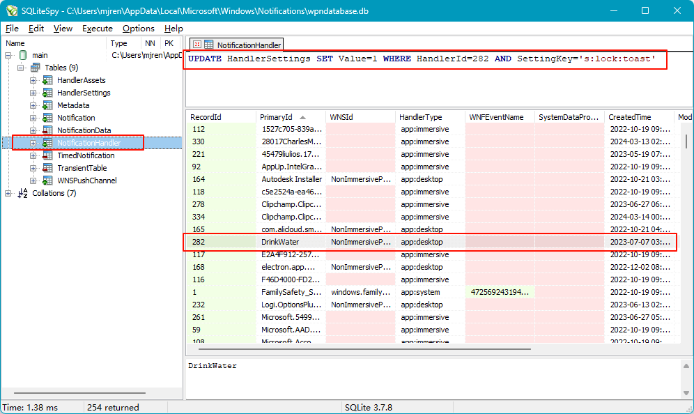
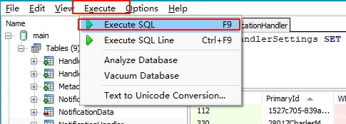

# window 重新打开已经关闭的应用通知

## 引言

在使用个人开发软件 [DrinkWater](https://github.com/cosy247/DrinkWater) 时不小心把通知关闭了，在系统设置的通知管理中并没有 [DrinkWater](https://github.com/cosy247/DrinkWater) 这个应用，记录一下没有被系统收录的软件关闭通知后如何再次打开的过程。


## 修改用户数据库数据

1. 文件路径：C:\Users\用户名\AppData\Local\Microsoft\Windows\Notifications\wpndatabase.db


其中 C:\Users\用户名\AppData 为隐藏文件夹，可以通过下图设置开启查看隐藏的文件和文件夹


2. 由于文件为 db 文件，可能打不开，需要下载额外的软件，这里使用 [SQLiteSpy](https://download.cnet.com/sqlitespy/3000-2065_4-75451503.html)，也可以使用其他的软件。

打开上面的 db 文件后页面如图：


3. 点击左边的 NotificationHandler 后后边将出现表格，点击 PrimaryId 进行排序，找到对应软件的数据行并记录 RecordId，这里时 282。



4. 在上面空白区域写入

```sql
UPDATE HandlerSettings SET Value=1 WHERE HandlerId=282 AND SettingKey='s:lock:toast'
```

需要将 282 替换为你需要修改软件的 RecordId。代码表示将左边 HandlerSettings 表中的 282 号软件的 s\:lock:toast 对应值改为 1。0 表示关闭，1 表示开启。



5. 最后选择 Execute > Execute SQL 执行代码。可以执行以下代码查看是否更改成功

```sql
SELECT * FROM HandlerSettings WHERE HandlerId=282 AND SettingKey='s:lock:toast'
```

6. win 版本不同，SettingKey 的名称可能不同。win11 为 s:lock:toast，win10 为 s:toast。在执行上面代码时替换即可，也可以将 s:lock:toast 和 s:toast 都执行一次。

7. 关闭时出现下面弹窗询问‘是否需要保存刚刚运行的代码’，这里选择 No 直接关闭即可。


## 修改注册表的数据

1. window + r 打开控制台输入 regedit 打开`注册表编辑器`，或者直接搜索 `注册表编辑器`打开。

2. 进入`HKEY_CURRENT_USER\SOFTWARE\Microsoft\Windows\CurrentVersion\Notifications\Settings`点击左侧对应软件


3. 将右方的`Enabled`行删除

## 测试

重新打开软件测试是否有消息提醒，如果没有可以重启电脑再试。
