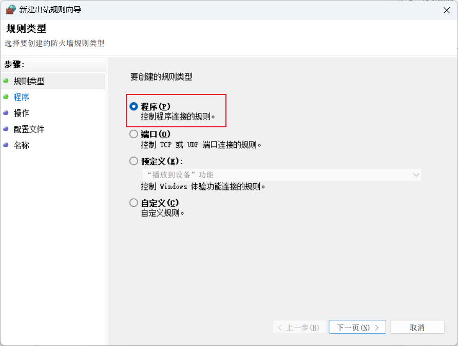

# Window 限制某些应用联网

在 Windows 系统中，可以通过防火墙设置来限制某些应用的联网权限。具体步骤如下：

#### 1. 进入 `设置>>网络和Internet>高级网络设置>右侧相关设置下的Windows防火墙>高级设置`，或者直接搜索 `防火墙进入`。

#### 2. 点击左侧 `出站规则`，再点击右侧 `新建规则` 并出现弹窗。

#### 3. 在弹窗种选择 `程序`，点击 `下一步`。

#### 4. 点击 `预览` 并选择程序，点击 `下一步`。

#### 5. 选择 `阻止连接`，点击 `下一步`。

#### 6. 根据需要选择需要阻止的网络连接类型，点击 `下一步`。

#### 7. 输入规则的 `名称`，点击 `完成`。

#### 8. 在出站规则列表中检查是否建立规则成功。

